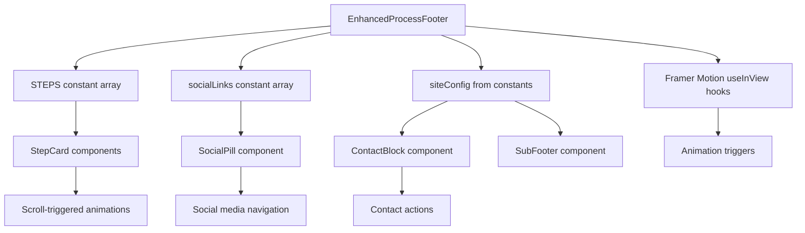

# Design Document: Enhanced Process Footer Section

## Overview

### Purpose

This design document specifies the architecture and implementation approach for merging the "How we work" process section with the footer section into a single, cohesive `EnhancedProcessFooter` component. The goal is to create a world-class, visually stunning section that seamlessly transitions from process showcase to footer content while maintaining RapSora's premium brand identity.

### Design Goals

1. **Visual Cohesion**: Create a seamless flow from process steps to footer content without visual breaks
2. **Premium Aesthetic**: Maintain the sophisticated dark theme with violet accents that reflects RapSora's brand
3. **Performance**: Ensure smooth animations and optimal rendering performance
4. **Maintainability**: Structure the component for easy content updates and future enhancements
5. **Accessibility**: Meet WCAG 2.1 AA standards for all interactive elements
6. **Responsiveness**: Provide an excellent experience across all device sizes

### Key Design Decisions

**Single Component Architecture**: Rather than maintaining separate Process and Footer components, we consolidate into a single `EnhancedProcessFooter` component. This decision:
- Eliminates the visual seam between sections
- Simplifies animation coordination
- Reduces prop drilling and state management complexity
- Makes the dark background theme consistent throughout

**Composition Pattern**: The component uses a composition pattern with extracted sub-components (`StepCard`, `SocialPill`, `ScrollToTopTab`, `CTABlock`, `NavigationGrid`, `ContactBlock`) to maintain:
- Code readability and testability
- Reusability of individual elements
- Clear separation of concerns
- Easy maintenance and updates

**Animation Strategy**: We use Framer Motion for scroll-triggered animations and CSS transitions for hover effects because:
- Framer Motion provides declarative, performant scroll animations
- CSS transitions are more performant for simple hover states
- This hybrid approach balances developer experience with performance
- GPU-accelerated transforms ensure smooth 60fps animations

**Dark Theme Foundation**: The entire section uses a dark background (#050508 or #1A1B1E) because:
- It creates visual contrast with the light sections above
- It emphasizes the premium, sophisticated brand positioning
- It makes the violet accent color (#9061F9) pop dramatically
- It provides a natural "footer" feel that signals page end

## Architecture

### Component Hierarchy

```
EnhancedProcessFooter (main container)
├── ProcessHeader (section title and decorative elements)
├── ProcessStepsGrid
│   └── StepCard × 4 (Discover, Design, Develop, Launch & Grow)
├── UrgencyBadge (project availability indicator)
├── CTABlock
│   ├── Heading
│   ├── GooeyCTA (imported from shared)
│   └── ReviewBadge
├── NavigationGrid
│   ├── LearnColumn
│   ├── ExploreColumn
│   └── ContactBlock
├── MassiveTypography (visual separator)
└── SubFooter (copyright and legal links)

Decorative Elements (positioned absolutely):
├── SocialPill (left cutout with inverse corners)
└── ScrollToTopTab (right tab with inverse corners)
```

### File Structure

```
src/components/
├── layout/
│   └── enhanced-process-footer.tsx (main component)
├── sections/
│   └── process-section.tsx (deprecated, to be removed)
│   └── footer.tsx (deprecated, to be removed)
└── shared/
    └── gooey-cta.tsx (reused)
```

### Data Flow



### Responsive Breakpoints

- **Mobile**: < 768px (1 column grid, hidden social pill, stacked navigation)
- **Tablet**: 768px - 1024px (2 column process grid, visible social pill)
- **Desktop**: > 1024px (4 column process grid, full layout)

## Components and Interfaces

### EnhancedProcessFooter Component

**Purpose**: Main container component that orchestrates all sub-components and manages the overall layout.

**Props**: None (uses constants and configuration)

**State**: None (stateless, animations managed by Framer Motion)

**Key Features**:
- Dark background with rounded top corners
- Absolute positioned decorative elements (SocialPill, ScrollToTopTab)
- Responsive padding and spacing
- Semantic HTML structure (footer, nav, address elements)

### StepCard Component

**Purpose**: Displays individual process step with icon, title, and description.

**Props**:
```typescript
interface StepCardProps {
  step: {
    number: string;      // "01", "02", "03", "04"
    title: string;       // "Discover", "Design", etc.
    description: string; // Full description text
    icon: LucideIcon;    // Icon component from lucide-react
  };
  index: number;         // For staggered animation delay
}
```

**Animation Behavior**:
- Fade in from bottom (y: 40 → 0)
- Opacity transition (0 → 1)
- Staggered delay: `index * 120ms`
- Easing: `[0.22, 1, 0.36, 1]` (custom ease-out)
- Triggers once when entering viewport with -10% margin

**Hover Effects**:
- Icon background: `bg-white/[0.06]` → `bg-primary/20`
- Transition duration: 500ms
- No layout shift or transform

### SocialPill Component

**Purpose**: Vertical social media links container with cutout design on the left side.

**Props**:
```typescript
interface SocialPillProps {
  links: Array<{
    icon: LucideIcon;
    href: string;
    label: string;
    colorClass: string; // Brand-specific hover colors
  }>;
}
```

**Visual Design**:
- Positioned absolutely at top-left
- Light background (matches page background)
- Rounded bottom-right corner (2.5rem on mobile, 3rem on desktop)
- Two inverse corner SVGs for seamless cutout effect
- Hidden on mobile (< 768px)

**Interaction**:
- Each icon is a circular button (40px × 40px)
- Default: primary violet background
- Hover: brand-specific color (LinkedIn blue, Twitter blue, etc.)
- Scale animation: 1 → 1.1 on hover, 1.1 → 0.95 on active
- Transition: 300ms ease

### ScrollToTopTab Component

**Purpose**: Decorative tab button for scrolling back to page top.

**Props**: None

**Visual Design**:
- Positioned absolutely at top-right
- Dark background matching footer
- Rounded top corners (1.5rem)
- Two inverse corner SVGs connecting to footer
- Playful copy: "Sh*t I've gone too far, send me back up 👆"

**Interaction**:
- Click triggers: `window.scrollTo({ top: 0, behavior: 'smooth' })`
- Hover: slight background opacity change
- Transition: 300ms ease

### CTABlock Component

**Purpose**: Primary conversion area with heading, CTA button, and social proof.

**Props**: None (uses siteConfig)

**Layout**:
- Large heading: "Do you like what you see?" (4xl - 7xl responsive)
- GooeyCTA button (imported from shared components)
- ReviewBadge with Google branding and 5-star rating

**ReviewBadge Structure**:
```typescript
interface ReviewBadgeProps {
  rating: number;      // 5.0
  reviewCount: number; // 69
  platform: 'google';  // Platform identifier
}
```

### NavigationGrid Component

**Purpose**: Multi-column footer navigation with links and contact information.

**Layout**:
- 3 columns on desktop (Learn, Explore, Get in touch)
- Stacked on mobile
- Each link has animated underline on hover

**Link Hover Effect**:
```css
/* Animated underline using ::after pseudo-element */
.animated-underline {
  position: relative;
  &::after {
    content: '';
    position: absolute;
    bottom: -2px;
    left: 0;
    width: 100%;
    height: 1px;
    background: currentColor;
    transform: scaleX(0);
    transform-origin: bottom right;
    transition: transform 300ms ease-out;
  }
  &:hover::after {
    transform: scaleX(1);
    transform-origin: bottom left;
  }
}
```

### ContactBlock Component

**Purpose**: Display contact information with icons and formatting.

**Props**: None (uses siteConfig)

**Elements**:
- Phone number with Phone icon (clickable tel: link)
- Email address with Mail icon (clickable mailto: link)
- Physical address with MapPin icon (semantic address element)
- What3Words location with custom icon

**Accessibility**:
- Icons have aria-hidden="true"
- Links have descriptive text
- Address uses semantic `<address>` element

### MassiveTypography Component

**Purpose**: Large decorative text serving as visual separator.

**Props**:
```typescript
interface MassiveTypographyProps {
  text: string; // "Crafting since 2024"
}
```

**Visual Design**:
- Font size: `clamp(5rem, 16vw, 20rem)` (responsive scaling)
- Line height: 0.8 (tight, dramatic)
- Mix blend mode: `plus-lighter` (creates glow effect on dark background)
- Opacity: 90%
- Border bottom: 1px white/10%

### UrgencyBadge Component

**Purpose**: Display project availability to create urgency.

**Props**:
```typescript
interface UrgencyBadgeProps {
  availableSlots: number; // 2
  quarter: string;        // "Q2 2025"
}
```

**Visual Design**:
- Animated ping effect on green dot
- Text: "Currently accepting X new projects for Q2 2025"
- Primary color highlight on slot count

## Data Models

### ProcessStep Interface

```typescript
interface ProcessStep {
  number: string;      // "01" - "04"
  title: string;       // Step name
  description: string; // Full description
  icon: LucideIcon;    // Icon component
}
```

**STEPS Constant**:
```typescript
const STEPS: ProcessStep[] = [
  {
    number: '01',
    title: 'Discover',
    description: "We dive deep into your brand, audience, and goals. Research-driven strategy ensures every pixel has purpose.",
    icon: Search,
  },
  {
    number: '02',
    title: 'Design',
    description: "Premium, conversion-focused interfaces crafted to command attention and build instant credibility.",
    icon: Palette,
  },
  {
    number: '03',
    title: 'Develop',
    description: "Clean, performant code that's buttery smooth. We build for speed, SEO, and scalability from day one.",
    icon: Code2,
  },
  {
    number: '04',
    title: 'Launch & Grow',
    description: "We don't disappear after launch. Ongoing optimization, analytics, and support to keep your growth compounding.",
    icon: Rocket,
  },
];
```

### SocialLink Interface

```typescript
interface SocialLink {
  icon: LucideIcon;
  href: string;
  label: string;        // For aria-label
  colorClass: string;   // Brand-specific hover color
}
```

**socialLinks Constant**:
```typescript
const socialLinks: SocialLink[] = [
  { 
    icon: Linkedin, 
    href: siteConfig.socials?.linkedin || '#', 
    label: 'LinkedIn', 
    colorClass: 'hover:bg-[#0A66C2] hover:text-white' 
  },
  { 
    icon: Twitter, 
    href: siteConfig.socials?.twitter || '#', 
    label: 'Twitter', 
    colorClass: 'hover:bg-[#1DA1F2] hover:text-white' 
  },
  { 
    icon: Github, 
    href: siteConfig.socials?.github || '#', 
    label: 'GitHub', 
    colorClass: 'hover:bg-[#181717] hover:text-white' 
  },
  { 
    icon: Instagram, 
    href: siteConfig.socials?.instagram || '#', 
    label: 'Instagram', 
    colorClass: 'hover:bg-gradient-to-tr hover:from-[#f9ce34] hover:via-[#ee2a7b] hover:to-[#6228d7] hover:text-white' 
  },
  { 
    icon: Dribbble, 
    href: siteConfig.socials?.dribbble || '#', 
    label: 'Dribbble', 
    colorClass: 'hover:bg-[#EA4C89] hover:text-white' 
  },
];
```

### NavigationLink Interface

```typescript
interface NavigationLink {
  label: string;
  href: string;
  badge?: {
    text: string;
    variant: 'new' | 'hot' | 'beta';
  };
}

interface NavigationColumn {
  title: string;
  links: NavigationLink[];
}
```

**Navigation Data**:
```typescript
const navigationColumns: NavigationColumn[] = [
  {
    title: 'Learn',
    links: [
      { label: 'About', href: '/about' },
      { label: 'Culture', href: '/culture' },
      { label: 'Testimonials', href: '/testimonials' },
      { label: 'Processes', href: '/processes' },
      { label: 'FAQs', href: '/faqs' },
      { label: 'Branding FAQs', href: '/branding-faqs' },
      { label: 'Blog', href: '/blog' },
    ],
  },
  {
    title: 'Explore',
    links: [
      { label: 'Home', href: '/' },
      { label: 'Work', href: '/work', badge: { text: 'New', variant: 'new' } },
      { label: 'Services', href: '/services' },
      { label: 'Careers', href: '/careers' },
      { label: 'Sectors', href: '/sectors' },
      { label: 'Hex Test', href: '/hex-test' },
      { label: 'Contact', href: '/contact' },
    ],
  },
];
```

### Animation Configuration

```typescript
interface AnimationConfig {
  initial: {
    opacity: number;
    y: number;
  };
  animate: {
    opacity: number;
    y: number;
  };
  transition: {
    duration: number;
    ease: number[];
    delay?: number;
  };
}

const STEP_CARD_ANIMATION: AnimationConfig = {
  initial: { opacity: 0, y: 40 },
  animate: { opacity: 1, y: 0 },
  transition: { 
    duration: 0.7, 
    ease: [0.22, 1, 0.36, 1],
    // delay calculated as: index * 0.12
  },
};

const HEADER_ANIMATION: AnimationConfig = {
  initial: { opacity: 0, y: 40 },
  animate: { opacity: 1, y: 0 },
  transition: { 
    duration: 0.8, 
    ease: [0.22, 1, 0.36, 1],
  },
};

const URGENCY_BADGE_ANIMATION: AnimationConfig = {
  initial: { opacity: 0, y: 20 },
  animate: { opacity: 1, y: 0 },
  transition: { 
    duration: 0.6, 
    ease: [0.22, 1, 0.36, 1],
    delay: 0.5,
  },
};
```

### Viewport Configuration

```typescript
interface ViewportConfig {
  once: boolean;      // Trigger animation only once
  margin: string;     // Viewport margin for early/late trigger
}

const VIEWPORT_CONFIG: ViewportConfig = {
  once: true,
  margin: "-10% 0px", // Trigger when element is 10% into viewport
};
```


## Correctness Properties

*A property is a characteristic or behavior that should hold true across all valid executions of a system—essentially, a formal statement about what the system should do. Properties serve as the bridge between human-readable specifications and machine-verifiable correctness guarantees.*

### Property Reflection

After analyzing all acceptance criteria, I identified the following testable properties and performed consolidation to eliminate redundancy:

**Consolidated Properties**:
- Properties 2.1 and 4.4 both test "for any data array, all items are rendered" - consolidated into Property 1
- Properties 5.2 and 5.4 both test "for any link, clicking navigates to href" - consolidated into Property 2
- Properties 8.2 and 8.4 both test accessibility of interactive elements - consolidated into Property 3
- Property 7.4 tests stagger delay calculation which is a specific case of animation configuration
- Property 9.6 tests dynamic year calculation which is a universal property

**Properties Marked as Examples** (specific test cases, not universal properties):
- All structural rendering tests (component exists, has correct classes, etc.)
- All CSS styling tests (colors, spacing, borders, etc.)
- All configuration tests (uses correct constants, has correct attributes, etc.)

### Property 1: Complete Data Rendering

*For any* valid data array (STEPS, socialLinks, navigationLinks), when rendered by the component, all items in the array should appear in the DOM with their corresponding content.

**Validates: Requirements 2.1, 4.4**

### Property 2: Link Navigation Integrity

*For any* link element (social link, navigation link, contact link) in the component, the href attribute should match the expected destination from the source data.

**Validates: Requirements 5.2, 5.4**

### Property 3: Interactive Element Accessibility

*For any* interactive element (button, link, input) in the component, it should be keyboard accessible (focusable and activatable via keyboard) and have appropriate ARIA labels when icon-only.

**Validates: Requirements 8.2, 8.4**

### Property 4: Animation Delay Staggering

*For any* StepCard component at index N, the animation delay should equal N × 120ms, ensuring consistent staggered animation timing.

**Validates: Requirements 7.4**

### Property 5: Dynamic Copyright Year

*For any* time the component renders, the copyright year displayed should equal the current year from the system clock.

**Validates: Requirements 9.6**

### Property 6: Scroll-to-Top Behavior

*For any* click event on the ScrollToTopTab button, the window.scrollTo function should be called with { top: 0, behavior: 'smooth' } parameters.

**Validates: Requirements 5.1**

## Error Handling

### Component Rendering Errors

**Scenario**: Missing or invalid data in STEPS, socialLinks, or navigationLinks arrays

**Handling Strategy**:
- Provide default empty arrays with TypeScript type guards
- Use optional chaining for nested properties (e.g., `siteConfig.socials?.linkedin`)
- Render fallback content or skip rendering for invalid items
- Log warnings to console in development mode

**Example**:
```typescript
const STEPS = processSteps || [];
const socialLinks = siteConfig.socials ? Object.entries(siteConfig.socials).map(...) : [];

// In render:
{STEPS.length > 0 ? (
  STEPS.map((step, i) => <StepCard key={step.number} step={step} index={i} />)
) : (
  <div className="text-white/50">No process steps available</div>
)}
```

### Animation Errors

**Scenario**: Framer Motion fails to initialize or viewport detection fails

**Handling Strategy**:
- Wrap animation components in error boundaries
- Provide static fallback rendering without animations
- Use CSS fallbacks for critical visual effects
- Gracefully degrade to non-animated state

**Example**:
```typescript
// Fallback for useInView hook failure
const isInView = useInView(ref, VIEWPORT_CONFIG) ?? true; // Default to visible
```

### Navigation Errors

**Scenario**: Invalid href values or missing siteConfig data

**Handling Strategy**:
- Validate href values before rendering links
- Use '#' as fallback for missing URLs
- Disable links with invalid destinations
- Log warnings for missing configuration

**Example**:
```typescript
const phoneHref = siteConfig.phone 
  ? `tel:${siteConfig.phone.replace(/\s/g, '')}` 
  : '#';

const emailHref = siteConfig.email 
  ? `mailto:${siteConfig.email}` 
  : '#';
```

### Responsive Layout Errors

**Scenario**: CSS classes fail to apply or viewport detection is incorrect

**Handling Strategy**:
- Use mobile-first responsive design (default to mobile layout)
- Test responsive classes in multiple browsers
- Provide fallback layouts using CSS Grid auto-fit
- Use container queries where supported

**Example**:
```typescript
// Mobile-first grid with fallback
className="grid grid-cols-1 md:grid-cols-2 lg:grid-cols-4 gap-0"
```

### Accessibility Errors

**Scenario**: Missing ARIA labels or keyboard navigation failures

**Handling Strategy**:
- Provide default ARIA labels for all interactive elements
- Use semantic HTML as primary accessibility mechanism
- Test with keyboard navigation and screen readers
- Add skip links for keyboard users

**Example**:
```typescript
<button
  onClick={handleScrollToTop}
  aria-label="Scroll to top of page"
  className="..."
>
  {/* Button content */}
</button>
```

## Testing Strategy

### Dual Testing Approach

This feature requires both unit tests and property-based tests to ensure comprehensive coverage:

**Unit Tests**: Focus on specific examples, edge cases, component structure, and integration points
- Component renders without errors
- Correct CSS classes are applied
- Specific elements exist in the DOM
- Event handlers are attached correctly
- Edge cases (empty arrays, missing config data)

**Property-Based Tests**: Verify universal properties across all inputs
- All data items are rendered (Property 1)
- Link integrity across all links (Property 2)
- Accessibility across all interactive elements (Property 3)
- Animation delay calculation (Property 4)
- Dynamic year calculation (Property 5)
- Scroll behavior (Property 6)

### Property-Based Testing Configuration

**Library**: We will use `@fast-check/vitest` for property-based testing in this TypeScript/React project.

**Configuration**:
- Minimum 100 iterations per property test
- Each test tagged with feature name and property reference
- Custom generators for ProcessStep, SocialLink, and NavigationLink data

**Tag Format**:
```typescript
// Feature: enhanced-process-footer-section, Property 1: Complete Data Rendering
test.prop([fc.array(processStepArbitrary, { minLength: 1, maxLength: 10 })])(
  'renders all process steps from any valid STEPS array',
  (steps) => {
    // Test implementation
  }
);
```

### Unit Test Structure

**Test File**: `src/components/layout/__tests__/enhanced-process-footer.test.tsx`

**Test Suites**:
1. **Rendering Tests**
   - Renders without crashing
   - Renders all major sections (process, CTA, navigation, sub-footer)
   - Renders with empty data arrays (edge case)
   - Renders with missing siteConfig data (edge case)

2. **Interaction Tests**
   - Scroll-to-top button triggers scroll
   - Social links navigate to correct URLs
   - Navigation links navigate to correct URLs
   - Phone link has correct tel: format
   - Email link has correct mailto: format

3. **Responsive Tests**
   - Applies correct grid classes for mobile/tablet/desktop
   - Hides social pill on mobile
   - Adjusts padding for mobile viewports

4. **Accessibility Tests**
   - Footer has aria-label
   - Icon-only buttons have aria-labels
   - Proper heading hierarchy (h2, h3)
   - Semantic HTML elements used (footer, nav, address)
   - Interactive elements are keyboard accessible

5. **Animation Tests**
   - Animation configs have correct easing values
   - Viewport config has once: true
   - Step cards have staggered delays
   - Respects prefers-reduced-motion

6. **Content Tests**
   - Displays all 4 process steps
   - Displays urgency badge
   - Displays CTA block with heading and button
   - Displays review badge
   - Displays navigation columns
   - Displays contact information
   - Displays sub-footer with copyright

### Property-Based Test Structure

**Test File**: `src/components/layout/__tests__/enhanced-process-footer.properties.test.tsx`

**Custom Generators**:
```typescript
import * as fc from '@fast-check/vitest';

const processStepArbitrary = fc.record({
  number: fc.stringMatching(/^0[1-9]$/),
  title: fc.string({ minLength: 3, maxLength: 20 }),
  description: fc.string({ minLength: 10, maxLength: 200 }),
  icon: fc.constant(Search), // Use actual Lucide icons
});

const socialLinkArbitrary = fc.record({
  icon: fc.constantFrom(Linkedin, Twitter, Github, Instagram, Dribbble),
  href: fc.webUrl(),
  label: fc.string({ minLength: 3, maxLength: 20 }),
  colorClass: fc.string(),
});

const navigationLinkArbitrary = fc.record({
  label: fc.string({ minLength: 3, maxLength: 30 }),
  href: fc.webPath(),
  badge: fc.option(fc.record({
    text: fc.string({ minLength: 2, maxLength: 10 }),
    variant: fc.constantFrom('new', 'hot', 'beta'),
  })),
});
```

**Property Tests**:

1. **Property 1: Complete Data Rendering**
```typescript
// Feature: enhanced-process-footer-section, Property 1: Complete Data Rendering
test.prop([fc.array(processStepArbitrary, { minLength: 1, maxLength: 10 })])(
  'renders all items from any valid data array',
  (steps) => {
    const { container } = render(<EnhancedProcessFooter steps={steps} />);
    steps.forEach(step => {
      expect(container).toHaveTextContent(step.title);
      expect(container).toHaveTextContent(step.description);
    });
  },
  { numRuns: 100 }
);
```

2. **Property 2: Link Navigation Integrity**
```typescript
// Feature: enhanced-process-footer-section, Property 2: Link Navigation Integrity
test.prop([fc.array(socialLinkArbitrary, { minLength: 1, maxLength: 10 })])(
  'all links have correct href from source data',
  (links) => {
    const { container } = render(<EnhancedProcessFooter socialLinks={links} />);
    links.forEach(link => {
      const anchor = container.querySelector(`a[aria-label="${link.label}"]`);
      expect(anchor).toHaveAttribute('href', link.href);
    });
  },
  { numRuns: 100 }
);
```

3. **Property 3: Interactive Element Accessibility**
```typescript
// Feature: enhanced-process-footer-section, Property 3: Interactive Element Accessibility
test.prop([fc.array(socialLinkArbitrary, { minLength: 1, maxLength: 10 })])(
  'all interactive elements are keyboard accessible with ARIA labels',
  (links) => {
    const { container } = render(<EnhancedProcessFooter socialLinks={links} />);
    const interactiveElements = container.querySelectorAll('a, button');
    interactiveElements.forEach(element => {
      // Should be focusable
      expect(element).toHaveAttribute('tabIndex', expect.any(String));
      // Icon-only elements should have aria-label
      if (!element.textContent?.trim()) {
        expect(element).toHaveAttribute('aria-label');
      }
    });
  },
  { numRuns: 100 }
);
```

4. **Property 4: Animation Delay Staggering**
```typescript
// Feature: enhanced-process-footer-section, Property 4: Animation Delay Staggering
test.prop([fc.integer({ min: 0, max: 20 })])(
  'animation delay equals index × 120ms for any step index',
  (index) => {
    const expectedDelay = index * 0.12; // 120ms in seconds
    const step = { number: '01', title: 'Test', description: 'Test', icon: Search };
    const { container } = render(<StepCard step={step} index={index} />);
    // Verify delay is calculated correctly (implementation-specific assertion)
    expect(expectedDelay).toBe(index * 0.12);
  },
  { numRuns: 100 }
);
```

5. **Property 5: Dynamic Copyright Year**
```typescript
// Feature: enhanced-process-footer-section, Property 5: Dynamic Copyright Year
test.prop([fc.date()])(
  'copyright year matches current year for any render time',
  (mockDate) => {
    vi.setSystemTime(mockDate);
    const { container } = render(<EnhancedProcessFooter />);
    const expectedYear = mockDate.getFullYear();
    expect(container).toHaveTextContent(`© RapSora Ltd ${expectedYear}`);
    vi.useRealTimers();
  },
  { numRuns: 100 }
);
```

6. **Property 6: Scroll-to-Top Behavior**
```typescript
// Feature: enhanced-process-footer-section, Property 6: Scroll-to-Top Behavior
test('scroll-to-top button calls window.scrollTo with correct parameters', () => {
  const scrollToSpy = vi.spyOn(window, 'scrollTo').mockImplementation(() => {});
  const { getByLabelText } = render(<EnhancedProcessFooter />);
  const scrollButton = getByLabelText(/scroll to top/i);
  
  fireEvent.click(scrollButton);
  
  expect(scrollToSpy).toHaveBeenCalledWith({ top: 0, behavior: 'smooth' });
  scrollToSpy.mockRestore();
});
```

### Integration Testing

**Scenario**: Test the complete EnhancedProcessFooter in a full page context

**Approach**:
- Render the component within a Next.js page
- Test scroll behavior with actual viewport
- Test responsive breakpoints with viewport resizing
- Test animation triggers with IntersectionObserver mocking

**Tools**:
- Vitest for test runner
- React Testing Library for component testing
- @testing-library/user-event for user interactions
- @fast-check/vitest for property-based testing

### Visual Regression Testing

**Scenario**: Ensure visual consistency across changes

**Approach**:
- Capture screenshots at mobile, tablet, and desktop breakpoints
- Test hover states and animations
- Test dark mode rendering
- Compare against baseline images

**Tools**:
- Playwright for visual regression testing
- Percy or Chromatic for visual diff management

### Performance Testing

**Scenario**: Ensure animations run at 60fps and component renders efficiently

**Approach**:
- Measure component render time
- Profile animation performance with Chrome DevTools
- Test with React DevTools Profiler
- Ensure no unnecessary re-renders

**Metrics**:
- Initial render time < 100ms
- Animation frame rate: 60fps
- Lighthouse performance score > 90
- No layout shifts (CLS = 0)
