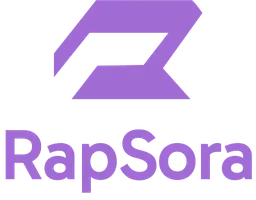
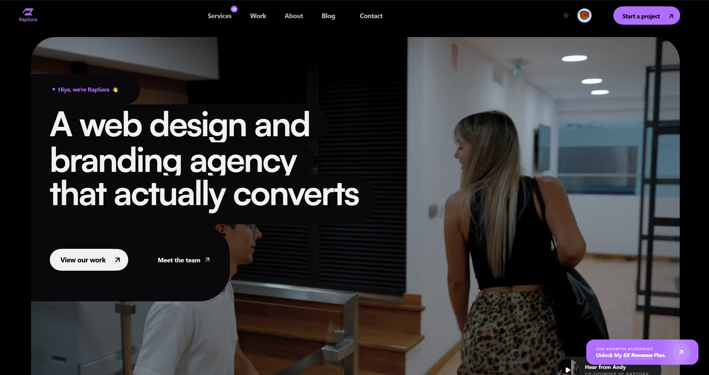
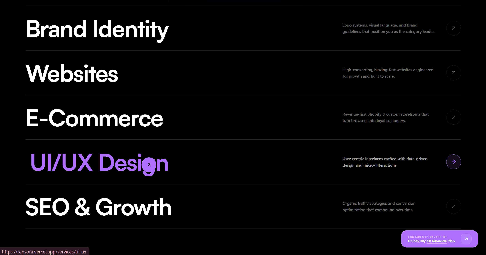
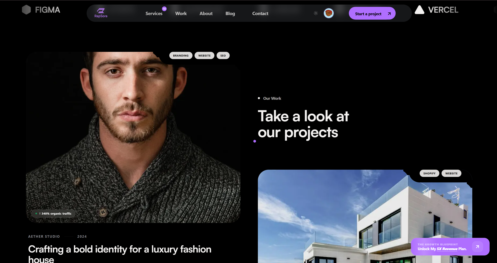
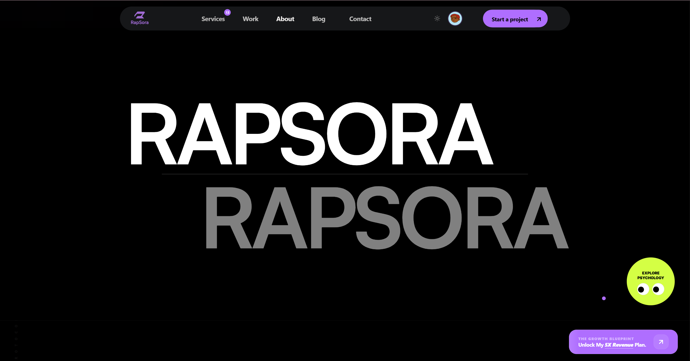
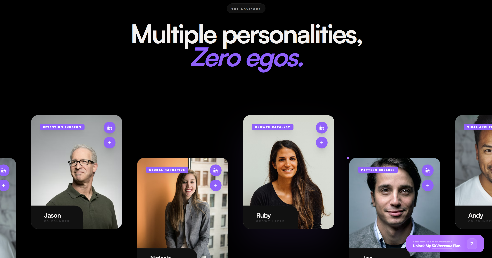
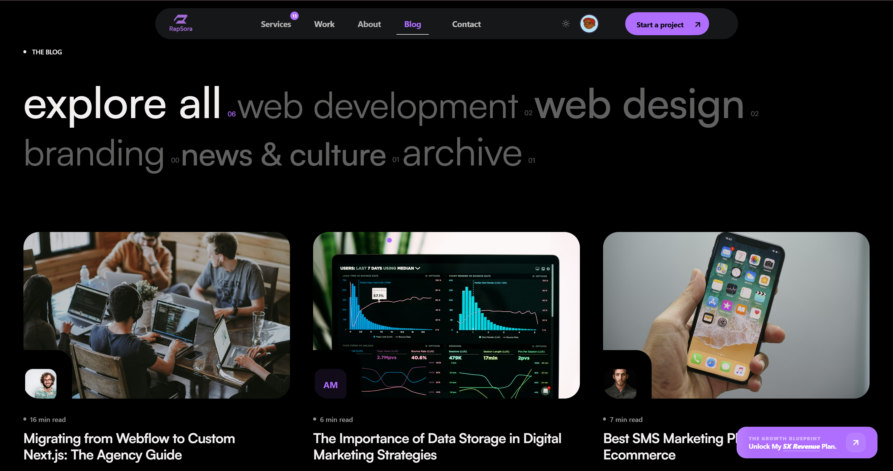
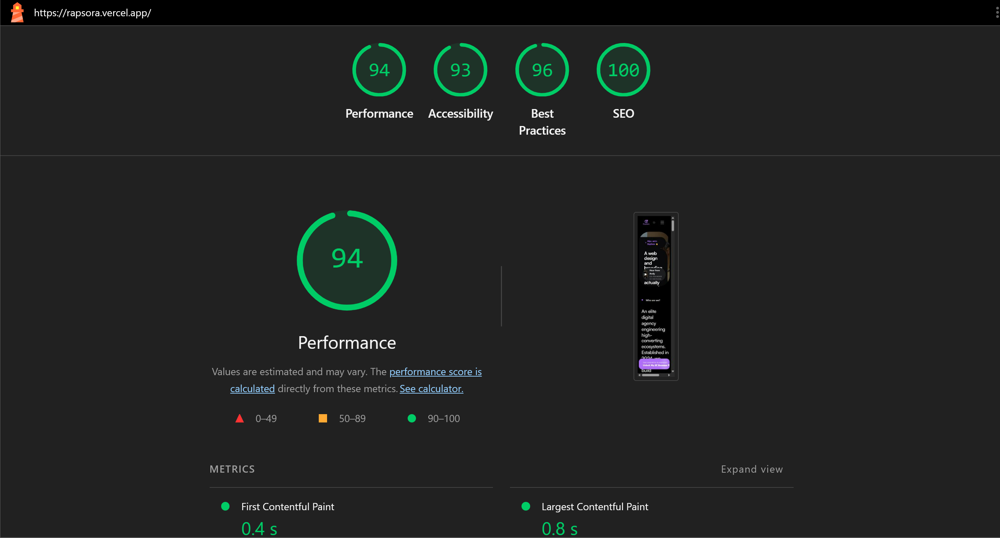
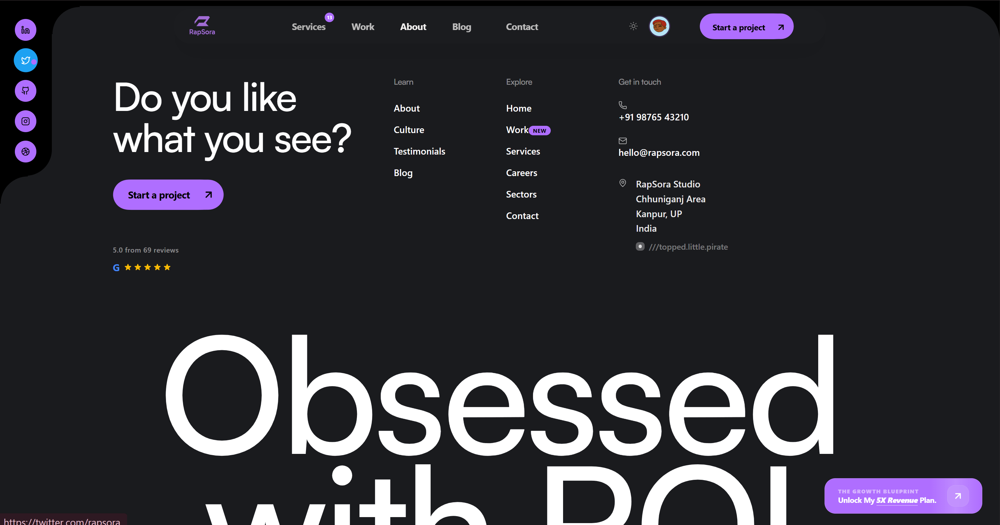
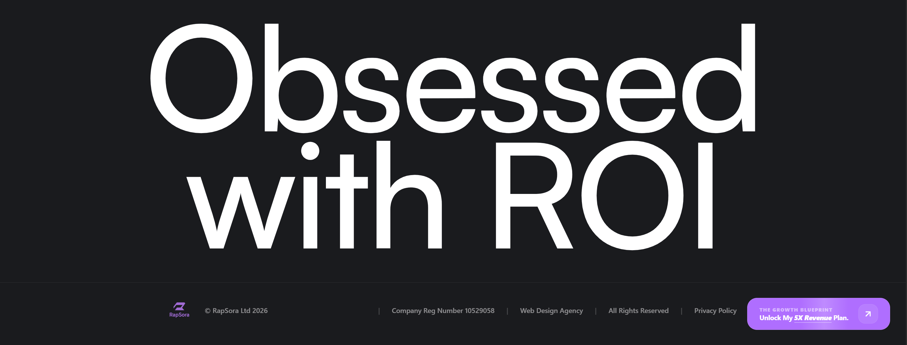

<div align="center">
  
  
  <h1 align="center">RapSora — Premium Web Agency Platform</h1>

  <p align="center">
    <strong><em>We design & build websites that actually convert.</em></strong>
    <br />
    <a href="https://rapsora.vercel.app/"><strong>Explore Live Site »</strong></a>
    ·
    <a href="https://github.com/Adityas3111N/rapsora/issues">Report Bug</a>
  </p>
</div>

<!-- Tech Stack Badges -->
<div align="center">
  
  
  
  
  
</div>

<br />

<div align="center">
  
</div>

## 📖 Overview

**RapSora** is a high-end web development and design agency platform. Built to serve as the ultimate digital portfolio and lead-generation machine, the site is engineered on a strict psychological conversion framework. 

It does not just look beautiful—it systematically guides visitors from initial curiosity to trust and finally conversion. Built natively on **Next.js 16** with **Framer Motion**, the site features uncompromising 60fps animations and a sophisticated dark-mode aesthetic centered around the brand's signature Purple (`#7C3AED`).

---

## ✨ Key Features & Conversion Architecture

*(All UI components are modularly built to guide visitor psychology)*

### 🧠 Psychological Flow & Hero
Leveraging the **Primacy Effect**, the hero section hooks users in 3 seconds. It utilizes **Hick's Law** to eliminate decision paralysis with a sticky, single-path CTA header.

<div align="center">
  
  &nbsp;
  
</div>

### 🎬 Fluid Micro-Animations & Showcase
The site feels alive without being overwhelming. Engineered utilizing **Framer Motion**, elements stagger in on scroll, project cards utilize smooth scaling overlays, and the navigation shifts cleanly using glass-morphism.

<div align="center">
  
</div>

### 🏢 Team & Culture
A digital agency is only as good as its team. The platform includes dedicated sections to highlight company culture, the core team, and the collaborative environment, building instant trust with potential clients.

<div align="center">
  
  &nbsp;
  
</div>

### 📚 Blog & Insights
Integrated blog section to drive organic traffic (SEO) and establish industry authority.

<div align="center">
  
</div>

### ⚡ Uncompromising Performance
Performance is a feature. The platform targets exceptional Lighthouse scores by utilizing Next.js React Server Components (RSC), optimized image delivery, and Tailwind CSS v4, ensuring rapid load times.

<div align="center">
  
</div>

---

## 🏗️ Technical Implementation

The architecture separates concerns cleanly to allow the agency to scale content effortlessly:

* **Strict App Router Structure:** Clean routing (`/work`, `/services`, `/blog`) powered by Next.js 16.
* **Radix UI & Shadcn:** Headless accessible components customized heavily to eliminate typical component-library fatigue.
* **Component-Driven Narrative:** The homepage is a sequence of highly decoupled sectional components.
* **Database Readiness:** Configured with `mongoose` and `next-auth` to seamlessly support blog CMS capabilities and client lead capture dashboards.
* **Performance Focused:** Targets a **95+ Lighthouse Score** utilizing React Server Components (RSC) and Tailwind CSS v4.

---

## 🛠️ Technology Stack

| Category | Technology | Description |
| :--- | :--- | :--- |
| **Frontend** | Next.js 16 (App Router) | Core React framework leveraging server components. |
| **Language** | TypeScript | Strictly typed for maintainability and fewer runtime errors. |
| **Styling** | Tailwind CSS v4 | Utility-first styling for rapid UI development. |
| **UI Components** | shadcn/ui & Radix UI | Accessible, unstyled primitives for custom design. |
| **Animations** | Framer Motion | Fluid, physics-based micro-interactions. |
| **Backend/Auth**| NextAuth (v5 beta) | Secure, session-based authentication. |
| **Database** | MongoDB (Mongoose) | NoSQL data store for blog content and leads. |

---

## ⚙️ Running Locally

### 1. Clone & Install
```bash
git clone https://github.com/Adityas3111N/rapsora.git
cd rapsora
npm install
```

### 2. Environment Setup
Create a `.env.local` file at the root. You will need variables for MongoDB and NextAuth to use full functionality.
```bash
cp .env.local.example .env.local
```

### 3. Start Development Server
```bash
npm run dev
```
Open [http://localhost:3000](http://localhost:3000) with your browser to see the live site.

---

## 👨‍💻 Author

**Aditya Singh**
- LinkedIn: [Aditya Singh](https://www.linkedin.com/in/aditya-singh-0a7181349/)
- GitHub: [@Adityas3111N](https://github.com/Adityas3111N)
- Email: [singhaditya4333@gmail.com](mailto:singhaditya4333@gmail.com)

<div align="center">
  <br/>
  
  <br/><br/>
  
  <br/><br/>
  <i>"We build websites your competitors wish they had."</i>
</div>
